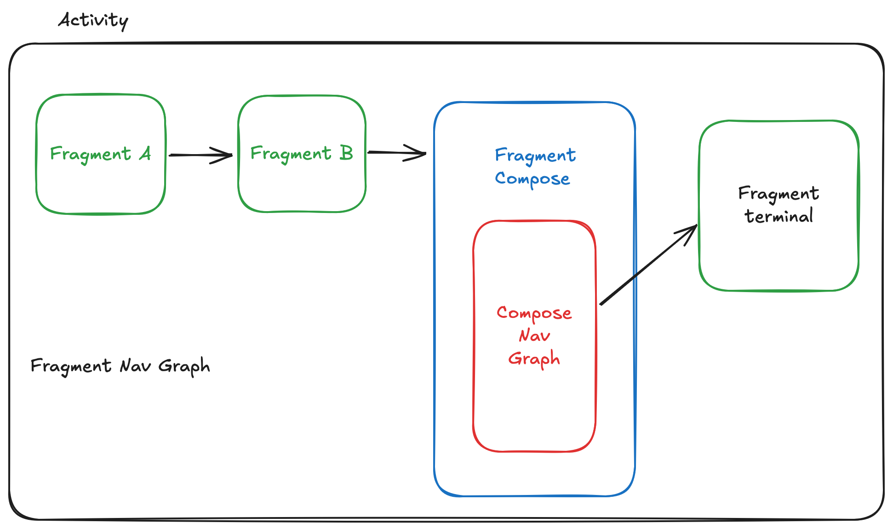

Android Hybrid Navigation: Fragment Navigation + Compose Navigation
================================================================================
This project is a sample project to demonstrate how to use Fragment Navigation 
and Compose Navigation in a single Android project.

The following image shows the navigation flow of the project:



The fragment navigation graph is defined in the 
[`nav_graph.xml`](app/src/main/res/navigation/nav_graph.xml) file. 

The Compose navigation graph is defined in the 
[`FragmentCompose.kt`](app/src/main/kotlin/com/bitwisearts/android/hybrid/FragmentCompose.kt) 
file. It uses the compose screens defined as sealed classes in the 
[`ComposeScreen.kt`](app/src/main/kotlin/com/bitwisearts/android/hybrid/ComposeScreen.kt)
file.

`ComposeScreen` is a sealed class that represents the different screens in the
compose navigation graph. It has a dual purpose: 

1. It is used to parameterize the Compose navigation composable function to 
   navigate to different screens allowing for passing arguments to the screens.
   this is achieved by making `ComposeScreen`s serializable using Kotlin's
   `@Serializer` annotation.
2. It is used to define the target entry points for the Compose navigation graph
   that can be passed to `FragmentCompose` as a safe navigation argument. This
   is done by making them `Parcelable` using the `@Parcelize` annotation.

The `FragmentCompose` fragment is a Compose fragment that takes a `ComposeScreen`
argument to navigate to the target screen. The argument is defined in the
`nav_graph.xml` file as an argument to the action that navigates to the 
`FragmentCompose` fragment:
```xml
<action
	android:id="@+id/action_FragmentB_to_FragmentCompose"
	app:destination="@id/FragmentCompose" >
	<argument
		android:name="composeTarget"
		app:argType="com.bitwisearts.android.hybrid.ComposeScreen" />
</action>
```

The `FragmentCompose` fragment uses the `ComposeScreen` argument passed to it as
a fragment nav arg to determine the target screen to navigate to. It uses the
`ComposeScreensNavGraph` composable function to navigate to the target screen:
```kotlin
@Composable
fun ComposeScreensNavGraph(
	startDestination: ComposeScreen,
	modifier: Modifier = Modifier
) {
	val navController = rememberNavController()
	NavHost(
		navController = navController,
		startDestination = startDestination,
		modifier = modifier
	) {
		// Nav targets are parameterized by the ComposeScreen sealed types
		composable<ComposeScreen.Home> { backStackEntry ->
			// Kotlin serialization serializes the Home class allowing it
			// to be passed in with nav argument data
			val home: ComposeScreen.Home = backStackEntry.toRoute()
			HomeScreen(home, navController)
		}
		composable<ComposeScreen.Details> {
			DetailsScreen(fragmentNavController)
		}
		composable<ComposeScreen.Settings> {
			SettingsScreen(navController)
		}
	}
}
```