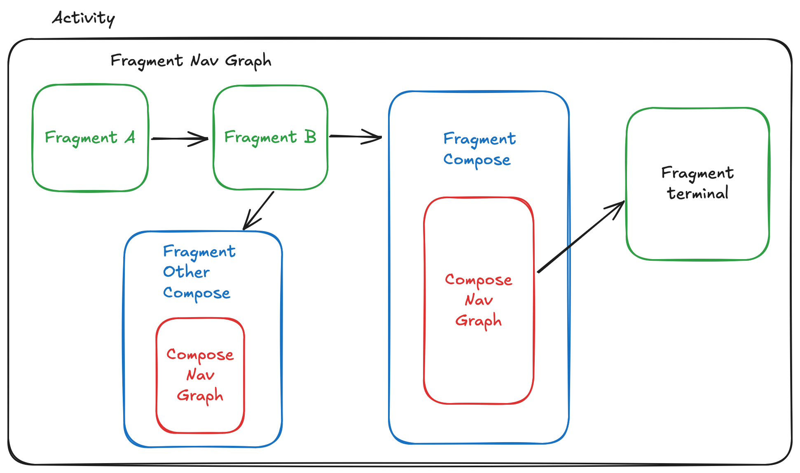

Android Hybrid Navigation: Fragment Navigation + Compose Navigation
================================================================================
This project is a sample project to demonstrate how to use Fragment Navigation 
and Compose Navigation in a single Android project. The reason to do this is to
allow for the gradual migration of an existing Android project built with
Android View to Jetpack Compose.

_**NOTE:** We don't use XML layouts for the Fragments in this project purely
for simplicity. In a real-world project, you would have XML layouts for the
Fragments that use Android View for its UI. Instead we use `ComposeView` to
make it simpler to create the UI for the Fragments._

The following image shows the navigation flow of the project:



The fragment navigation graph is defined in the 
[`nav_graph.xml`](app/src/main/res/navigation/nav_graph.xml) file. 

A Compose navigation graph is defined in the 
[`FragmentCompose.kt`](app/src/main/kotlin/com/bitwisearts/android/hybrid/FragmentCompose.kt) 
file. It uses the compose screens defined as sealed classes in the 
[`ComposeScreen.kt`](app/src/main/kotlin/com/bitwisearts/android/hybrid/ComposeScreen.kt)
file.

`ComposeScreen` is a sealed class that represents the different screens in the
compose navigation graph. It has a dual purpose: 

1. It is used to parameterize the Compose navigation composable function to 
   navigate to different screens allowing for passing arguments to the screens.
   this is achieved by making `ComposeScreen`s serializable using Kotlin's
   `@Serializer` annotation.
2. It is used to define the target entry points for the Compose navigation graph
   that can be passed to `FragmentCompose` as a safe navigation argument. This
   is done by making them `Parcelable` using the `@Parcelize` annotation.

The `FragmentCompose` fragment is a Compose fragment that takes a `ComposeScreen`
argument to navigate to the target screen. The argument is defined in the
`nav_graph.xml` file as an argument to the action that navigates to the 
`FragmentCompose` fragment:
```xml
<action
     android:id="@+id/action_FragmentB_to_FragmentCompose"
     app:destination="@id/FragmentCompose" >
   <argument
        android:name="composeTarget"
        app:argType="com.bitwisearts.android.hybrid.ComposeScreen" />
</action>
```

The `FragmentCompose` fragment uses the `ComposeScreen` argument passed to it as
a fragment nav arg to determine the target screen to navigate to. It uses the
`ComposeScreensNavGraph` composable function to navigate to the target screen:
```kotlin
@Composable
fun ComposeScreensNavGraph(
	startDestination: ComposeScreen,
	modifier: Modifier = Modifier
) {
	val navController = rememberNavController()
	NavHost(
		navController = navController,
		startDestination = startDestination,
		modifier = modifier
	) {
		// Nav targets are parameterized by the ComposeScreen sealed types
		composable<ComposeScreen.Home> { backStackEntry ->
			// Kotlin serialization serializes the Home class allowing it
			// to be passed in with nav argument data
			val home: ComposeScreen.Home = backStackEntry.toRoute()
			HomeScreen(home, navController)
		}
		composable<ComposeScreen.Details> {
			DetailsScreen(fragmentNavController)
		}
		composable<ComposeScreen.Settings> {
			SettingsScreen(navController)
		}
	}
}
```

### Independent Compose UI Navigation Graphs
To demonstrate that more than one Compose navigation graph can be used in a
single project, we have defined a second Compose navigation graph in the
[`FragmentOtherCompose.kt`](app/src/main/kotlin/com/bitwisearts/android/hybrid/FragmentOtherCompose.kt).
It is simpler than `FragmentCompose` and is only used to demonstrate that it is
possible to have more than one Compose navigation graph in a single project that
can be used independently of each other. This may be useful in a real-world
project where you have different parts of the app that are built with Compose
but navigated to independently of each other using different Fragments as entry
points.

### Back Stack Listeners and Custom Back Button Handling
It is possible to inject custom listeners to listen for changes in the back 
stack. It is also possible to override the default back button behavior to
implement custom back button handling. 

For the compose nav graph this is demonstrated in the 
[`FragmentCompose.kt`](app/src/main/kotlin/com/bitwisearts/android/hybrid/FragmentCompose.kt).
See the inline comments in the file for more details.

For the fragment nav graph this is demonstrated in the 
[`MainActivity.kt`](app/src/main/kotlin/com/bitwisearts/android/hybrid/MainActivity.kt).
The listeners are defined in the body of `MainActivity` with inline comments 
explaining the details of the listeners. The back navigation override is
described in the MainActivity's class comment with a code example. Greater care
must be taken when overriding the back button behavior in a mixed navigation
project as the back button override behavior is independent of the fragment and 
compose navigation stacks as it is captured by the activity's 
`onBackPressedDispatcher` and is triggered regardless of which navigation stack
is currently active. This makes it difficult to implement custom back button
behavior that is aware of the current navigation stack enough to implement
overriding behavior that will work as expected in all cases.